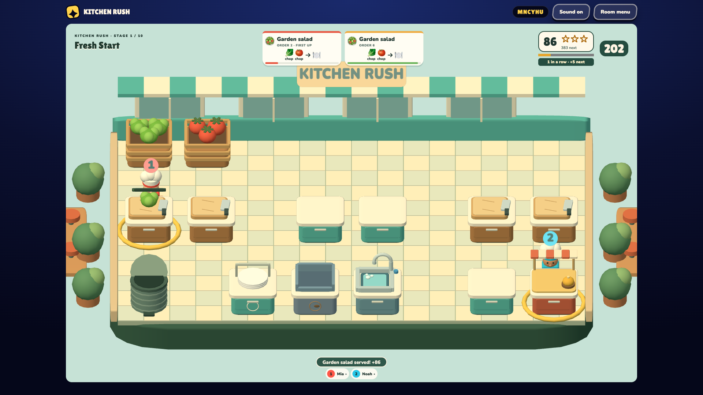
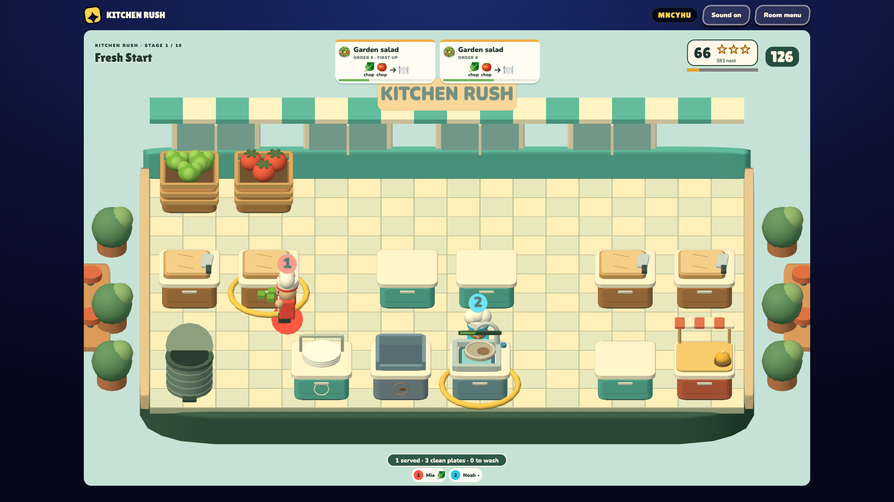
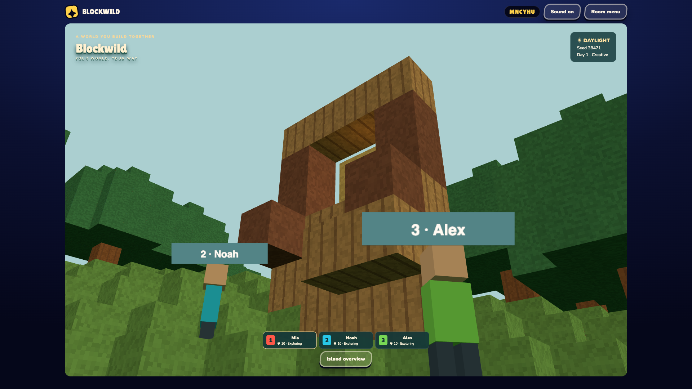
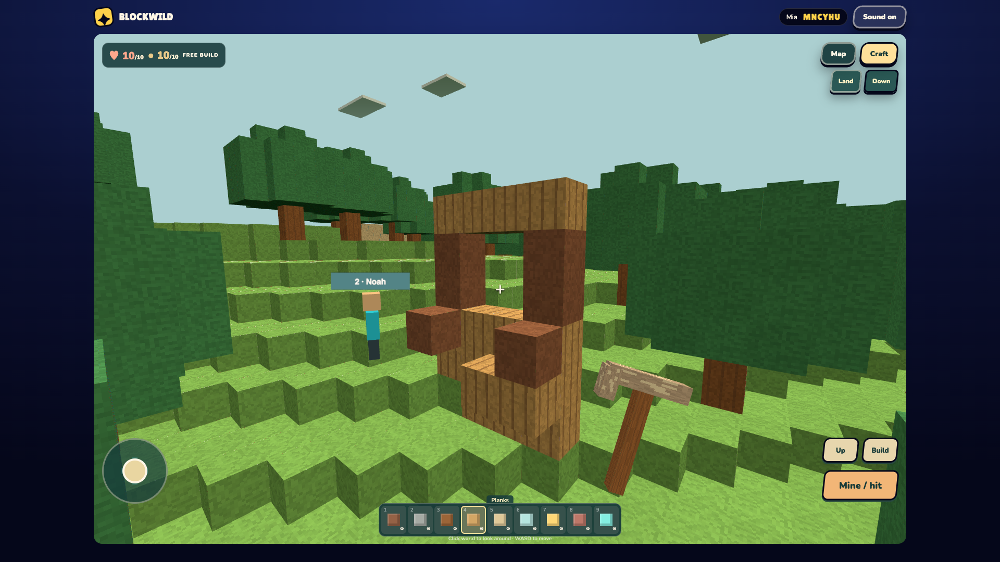
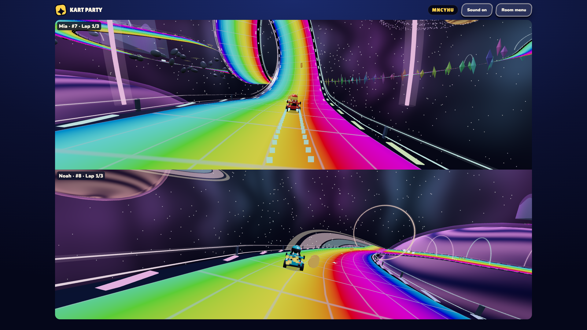
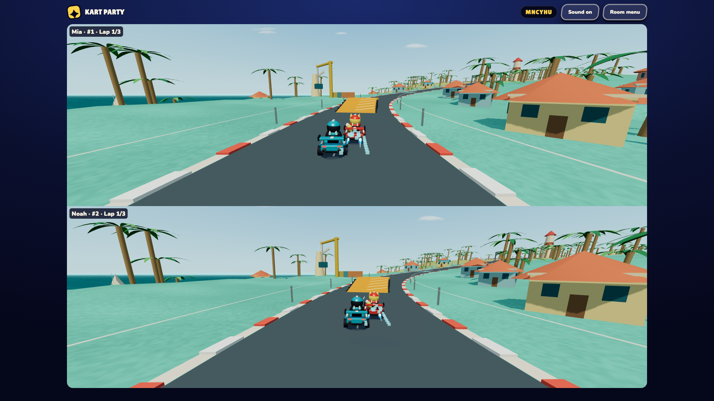

# Multiplayer screenshots · September 10, 2026

Six unedited 1920 × 1080 PNG screenshots, ready for repository pages or a social post. Each image captures one game window. Kart Party's split screen is the game's own shared display.

## Kitchen Rush

**Serving together.** Mia prepares the next salad while Noah works the serving pass. A completed garden salad has earned 86 points.

**Prep and dishes.** Mia carries chopped lettuce while Noah washes a plate for the next order.

## Blockwild

**Building together.** Noah and Alex beside the group's construction in a shared Creative world, viewed from Mia's position. The three players placed 25 blocks through the normal game controls.

**A player's view.** Mia's first-person building controls, materials, and pickaxe, with Noah visible beside their earlier construction.

## Kart Party

**Rainbow Road.** Mia approaches the vertical loop while Noah races through the planetary scenery, shown in the native two-player split screen.

**Seabreeze rivals.** Mia and Noah race side by side toward a ramp on Seabreeze Circuit.

## Capture notes

- Captured from the existing `local-host-05` build on an isolated local server, using real room joins and scripted keyboard/mouse inputs. Game code, rendering, scores, and world state were not patched for the images.
- Three visible browser windows were used: the shared display and separate Mia/Noah clients. The final Blockwild group view added Alex through an owned headless browser client. These are controlled demo players.
- Kitchen Rush used Fresh Start with a five-minute service. The session exercised ingredient collection, chopping, plating, successful service, and dishwashing.
- Blockwild used Creative mode and seed 38471. The session exercised movement, flight, block placement, saving, and resuming the saved world with an additional player.
- Kart Party used 100cc and three-lap races on Rainbow Road and Seabreeze Circuit, with two browser players and six CPU opponents. The captures show active steering, racing progress, and item/boost effects.
- This was a screenshot session with focused gameplay checks, not a full QA sign-off. Full round completion/replay, maximum rosters, physical phones, and offline play were not validated in this session.
